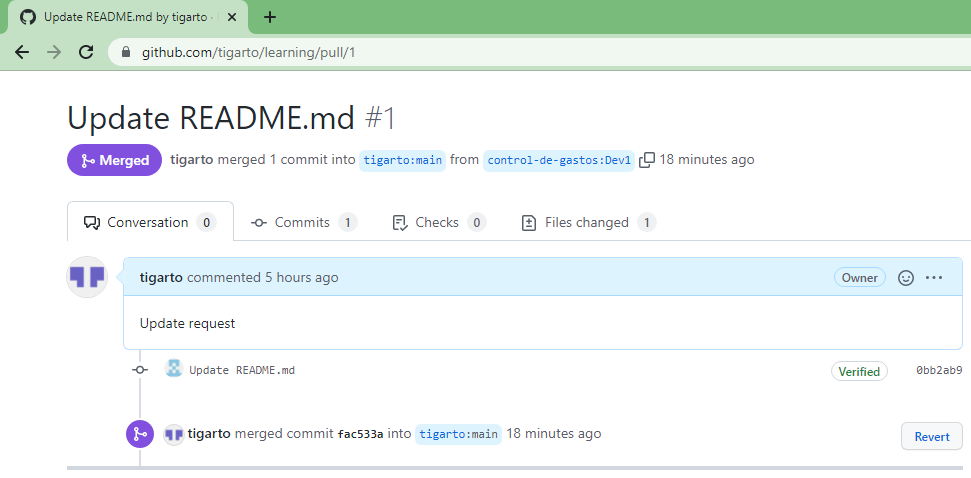

# learning
this will be used to learn how to make a git project collaboratively


Este es un comentario agregado por: @tigarto


Este es un comentario por:@edersamir

- [ x ] Para sincronizar se siguieron las siguientes instrucciones: https://www.freecodecamp.org/news/how-to-sync-your-fork-with-the-original-git-repository/


**Comandos aplicados**:

```
# Add a new remote upstream repository
git remote add upstream https://github.com/control-de-gastos/learning.git
git remote -v
git fetch upstream
# Sync your fork
git checkout Dev1
git merge upstream/Dev1
```

Luego en la pestaña de los request, aceptar el pull request, a continuación se muestra como quedo.



Luego de https://www.datacamp.com/community/tutorials/git-push-pull se siguio la siguiente instrucción despues de hacer cambios y usar el **add** y el **commit**:

```
git push 'remote_name' 'branch_name'
```

Para el caso:

```
git push -u origin Dev1
```

**Recomentacion**

Ver: https://docs.microsoft.com/es-es/learn/paths/django-create-data-driven-websites/
